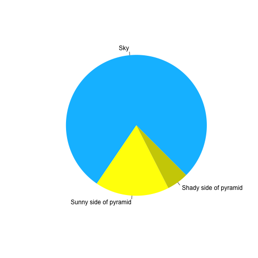

:::::::::::::::::::::::::::::::::::::: questions

- How do you create a new episode? 
- What syntax do you need to know to contribute to a lesson with The Carpentries Workbench?
- How do you write challenge blocks?
- What syntax do you use to write links?
- How do you include images?
- How do you include math?

::::::::::::::::::::::::::::::::::::::::::::::::

::::::::::::::::::::::::::::::::::::: objectives 

- Practise creating a new episode with R
- Understand the required elements for each episode
- Understand pandoc-flavored markdown
- Demonstrate how to include pieces of code, figures, and nested challenge blocks

::::::::::::::::::::::::::::::::::::::::::::::::

## Introduction

An episode[^episodes] is an individual unit of a lesson that focuses on a
single topic with clear questions, objectives, and key points. If a lesson goal
is to teach you about using git, an individual episode would teach you how to
inspect the status of a git repsitory. The idea behind the name "episode" is
the thought that each one should last about as long as an episode for an
television series.

As we will cover in the [next episode](editing.md), all of the episodes live
inside the `episodes/` directory at the top of the lesson folder. Their order is
dictated by the `episodes:` element in the `config.yaml` file (but defaults to 
alphabetical). The other folders (`learners/`, `instructors/`, and `profiles/`)
are similarly configured. This episode will briefly explain how to edit markdown
content in the lessons. 


:::::: prereq

### Buoyant Barnacle

The exercises in this episode correspond to the Buoyant Barnacle repository you
created in [the Introduction](introduction.md)

:::::::::::::

There are three things you should be comfortable with in order to contribute to
a lesson [^worry]

1. Writing [basic][basic-syntax] and [extended][extended-syntax] markdown syntax
2. Writing [Fenced div elements][fenced-divs] to create callouts and exercise
   blocks
2. Writing simple yaml lists

## Creating A New Episode

To create a new episode, you should open your lesson (`buoyant-barnacle`) in
your RStudio or your favorite text editor and in the R console type:

```r
sandpaper::create_episode("next-episode")
```

This will create a new episode in the episodes folder called
"02-next-episode.Rmd".  If you already have your episode schedule set in
`config.yaml`, then this episode will not be rendered in the site and will
remain a draft until you add it to the schedule. Next, we will show how you can
add a title and other elements to your episode.

:::::::::::::::::::::::::::::::: callout

### What is the `.Rmd` extension?

You might notice that the new episode has the extension of `.Rmd` instead of 
`.md`. This is R Markdown, an extension of markdown that allows us to insert
special code fences that can execute R code and automatically produce output
chunks with controls of how the output and input are rendered in the document. 

For example, this markdown code fence will not produce any output, but it is
valid for both Markdown and R Markdown. 

````markdown
```r
print("hello world!")
```
````

```r
print("hello world!")
```

But when I open the fence with ```` ```{r} ```` then it becomes an R Markdown
code fence and will execute the code inside the fence:


````markdown
```{r}
print("hello world!")
```
````


```r
print("hello world!")
```

```{.output}
[1] "hello world!"
```

Note that it is completely optional to use these special code fences! 

:::::::::::::::::::::::::::::::::::::::::

## Required Elements

To keep with our active learning principles, we want to be mindful about the 
content we present to the learners. We need to give them a clear title, 
questions and objectives, and an estimate of how long it will take to navigate
the episode (though this latter point has shown to be demoralizing). Finally, at
the end of the episode, we should reinforce the learners' progress with a summary
of key points.

### YAML metadata

The YAML syntax of an episode contains three elements of metadata associated
with the episode at the very top of the file: 

```yaml
---
title: "Using RMarkdown For Automated Reports" # Episode title
teaching: 5   # teaching time in minutes
exercises: 10 # exercise time in minutes
---

## First Episode Section
```

:::::::::::::::: challenge

### Create a Title

Your new episode needs a title! 

1. Open the new episode in your editor
2. edit the title
3. add the episode to the `config.yaml`
4. preview it with `sandpaper::build_lesson()`/<kbd>ctrl + shift + k</kbd>.

Did the new title show up?

::::::::::::::::::::::::::

### Questions, Objectives, Keypoints

These are three blocks that live at the top and bottom of the episodes. 

1. `questions` are displayed at the beginning of the episode to prime the
learner for the content
2. `objectives` are the learning objectives for an episode and are
displayed along with the questions
3. `keypoints` are displayed at the end of the episode to reinforce the
objectives

They are formatted as [pandoc fenced divisions][fenced-divs], which we will
explain in [the next section](#callout-blocks):

```markdown
---
title:
teaching:
exercises:
---

:::::: questions
 - question 1
 - question 2
::::::

:::::: objectives
 - objective 1
 - objective 2
::::::

<!-- EPISODE CONTENT HERE -->

:::::: keypoints
 - keypoint 1
 - keypoint 2
::::::
```


## Editing an episode: Callout blocks {#callout-blocks}

::::: callout

### Callout Component Guide

You can find a catalogue of the different callout blocks The Workbench supports
in [The Workbench Component Guide](component-guide.md).

::::::::::::


One of the key elements of our lessons are our callout blocks that give learners
and instructors a **bold visual cue** to stop and consider a caveat or exercise.
To create these blocks, we use [**pandoc fenced divisions, aka
_'fenced-divs'_**][fenced-divs], which are colon-delimited sections similar to 
code fences that can instruct the markdown interpreter how the content should be
styled. 

For example, to create a `callout` block, we would use *at least three colons*
followed by the `callout` tag (the tag designates an open fence), add our
content after a new line, and then close the fence with *at least three colons*
and no tag (which designates a closed fence):

```markdown
::: callout
This is a callout block. It contains at least three colons
:::
```

::: callout
This is a callout block. It contains at least three colons
:::

However, it may be difficult sometimes to keep track of a section if it's only
delimited by three colons. Because [the specification for fenced-divs require
*at least* three colons][fenced-divs], it's possible to include more to really
differentiate between these and headers or code fences:

```markdown
::::::::::::::::::::::::::::::::::::::::::::::: testimonial
I'm **really excited** for the _new template_ when it arrives :grin:.

--- Toby Hodges
:::::::::::::::::::::::::::::::::::::::::::::::::::::::::::
```

::::::::::::::::::::::::::::::::::::::::::::::: testimonial
I'm **really excited** for the _new template_ when it arrives :grin:.

--- Toby Hodges
:::::::::::::::::::::::::::::::::::::::::::::::::::::::::::

Even better, you do not have to worry about counting colons! It doesn't matter
how many colons you put for the opening and closing fences, all that matters is
you can visually see that the fences match. 

::::::::::::::::::::::::::::::::::::::::::::::: callout

That's right, we can use emojis in The Carpentries Workbench! :100: :tada:

:::::::::::::::::::::::::::::::::::::::::::::::::::::::

## Instructor Notes

A new feature in The Carpentries Workbench is separate instructor/learner views,
which allows for instructor notes to be incorporated into the lesson. The
default view of a lesson is the learner view, but you can switch to the 
instructor view by scrolling to the top of the lesson, clicking on the "Learner
View" button at the top right, and then selecting "Instructor View" from the
dropdown. You can also add `instructor/` after the lesson URL (e.g. in this
lesson, the URL is `https://carpentries.github.io/sandpaper-docs/episodes.html`;
to switch to the instructor view manually, you can use 
`https://carpentries.github.io/sandpaper-docs/instructor/episodes.html`. 


::::::::::::::: challenge

### View the instructor note

When you visit this page, the default is learner view. Scroll to the top of the
page and select "Instructor View" from the dropdown and return to this section
to find an instructor note waiting for you.

:::::::::::::::::::::::::::

::::::::::::::::::::::::::::::::::::::::::::::::::::::::::::::::::::: instructor

This is an instructor note. It contains information that can be useful for 
instructors to know such as

 - Useful hints about places that need extra attention
 - setup instructions for live coding
 - reminders of what the learners should already know
 - anything else

These notes are created with a pandoc fenced div that looks like this:

````markdown

::::::::::::::::::::::::::::::::::::: instructor

This is an instructor note. It contains information that can be useful for 
instructors to know such as

 - Useful hints about places that need extra attention
 - setup instructions for live coding
 - reminders of what the learners should already know
 - anything else

These notes are created with a pandoc fenced div that looks like this:

```markdown

... Instructor note markdown placehoder ...

```

:::::::::::::::::::::::::::::::::::::::::::::::::

````

::::::::::::::::::::::::::::::::::::::::::::::::::::::::::::::::::::::::::::::::


## Exercises/Challenges

the method of creating callout blocks with fences can help us create solution
blocks nested within challenge blocks. Much like a [toast
sandwich](https://en.wikipedia.org/wiki/Toast_sandwich), we can layer blocks
inside blocks by adding more layers. For example, here's how I would create a
single challenge and a single solution:

```markdown
::::::::::::::::::::::::::::::::::::: challenge

## Chemistry Joke

Q: If you aren't part of the solution, then what are you?

:::::::::::::::: solution

A: part of the precipitate

:::::::::::::::::::::::::
:::::::::::::::::::::::::::::::::::::::::::::::
```

::::::::::::::::::::::::::::::::::::: challenge

## Chemistry Joke

Q: If you aren't part of the solution, then what are you?

:::::::::::::::: solution

A: part of the precipitate

:::::::::::::::::::::::::
:::::::::::::::::::::::::::::::::::::::::::::::

To add more solutions, you close the first solution and add more text:

::::::::::::::::::::::::::::::::::::: challenge

## Challenge 1: Can you do it?

What is the output of this command?


```r
paste("This", "new", "template", "looks", "good")
```

:::::::::::::::::::::::: solution 

## Output
 

```{.output}
[1] "This new template looks good"
```

:::::::::::::::::::::::::::::::::


## Challenge 2: how do you nest solutions within challenge blocks?

:::::::::::::::::::::::: solution 

You can add a line with at least three colons and a `solution` tag.

:::::::::::::::::::::::::::::::::
::::::::::::::::::::::::::::::::::::::::::::::::


Now, here's a real challenge for you

:::::::::::::::::::::::::::::::::::::: challenge

Is the following fenced-div valid? Why?

```markdown
::::::::::::::::::::: my-class
This is a block of my class
:::
```

::::::::::::::::::::::: solution

Yes! It is a valid fenced div for the following reasons:

1. The opening fence has &ge;3 colons
2. The opening fence has a class designation
3. The closing fence is on its own line and has &ge;3 colons

:::::::::::::::::::::::::::::::::

:::::::::::::::::::::::::::::::::::::::::::::::::

## Code Blocks with Syntax Highlighting

To include code examples in your lesson, you can wrap it in three backticks like
so:

Input:

````markdown
```
thing = "python"
print("this is a {} code block".format(thing))
```
````
Output:

```
thing = "python"
print("this is a {} code block".format(thing))
```

To include a label and syntax highlighting, you can add a label after the first
set of backticks:

Input:

````markdown
```python
thing = "python"
print("this is a {} code block".format(thing))
```
````
Output:

```python
thing = "python"
print("this is a {} code block".format(thing))
```

To indicate that a code block is an output block, you can use the label "output":
Input:

````markdown
```python
thing = "python"
print("this is a {} code block".format(thing))
```

```output
this is a python code block
```

````
Output:

```python
thing = "python"
print("this is a {} code block".format(thing))
```

```output
this is a python code block
```

The number of available languages for syntax highlighting are numerous and
chances are, if you want to highlight a particular language, you can add the
language name as a label and it will work. A [full list of supported languages
is here, each language being a separate XML file definition](https://github.com/jgm/skylighting/tree/master/skylighting-core/xml).

## Tables

Tables in The Workbench follow the rules for [pandoc pipe table
syntax][pipe-table-syntax], which is the most portable form of tables.

Because we use pandoc for rendering, tables also have the following features:

1. You can add a table caption, which is great for accessibility[^tablecap]
2. You have control over the relative width of oversized table contents

Here is an example of a narrow table with three columns aligned left, center,
and right, respectively.

[pipe-table-syntax]: https://pandoc.org/MANUAL.html#extension-pipe_tables

:::::::::::::: callout

### Table alignment best practises

The colons on each side of the `-` in the table dictate how the column is
aligned. By default, columns are aligned left, but if you add colons on either
side, that forces the alignment to that side.

In general, most table contents should be left-aligned, with a couple of 
exceptions:

 - numbers should be right aligned
 - symbols, emojis, and other equal-width items may be center-aligned

These conventions make it easer for folks to scan a table and understand its
contents at a glance. 

::::::::::::::::::::::


```markdown
Table: Four fruits with color and price in imaginary dollars

| fruit  | color            | price    |
| ------ | :--------------: | -------: |
| apple  | :red_square:     | \$2.05   |
| pear   | :green_square:   | \$1.37   |
| orange | :orange_square:  | \$3.09   |
| devil  | :purple_square:  | \$666.00 |
```

Table: Four fruits with color and price in imaginary dollars

| fruit  | color            | price    |
| ------ | :--------------: | -------: |
| apple  | :red_square:     | \$2.05   |
| pear   | :green_square:   | \$1.37   |
| orange | :orange_square:  | \$3.09   |
| devil  | :purple_square:  | \$666.00 |

You can see that we now have a caption associated with The table
Because it is a narrow table, the columns fit exactly to the contents. If we
added a fourth, longer column (e.g. a description), then the table looks a bit
wonky:

```markdown
Table: Four fruits with color, price in imaginary dollars, and description

| fruit  | color            | price    | description |
| ------ | :--------------: | -------: | ----------- |
| apple  | :red_square:     | \$2.05   | a short, round-ish red fruit that is slightly tapered at one end. It tastes sweet and crisp like a fall day |
| pear   | :green_square:   | \$1.37   | a bell-shaped green fruit whose taste is sweet and mealy like a cold winter afternoon | 
| orange | :orange_square:  | \$3.09   | a round orange fruit with a dimply skin-like peel that you must remove before eating. It tastes of sweet and sour lazy summer days |
| devil  | :purple_square:  | \$666.00 | a round purple fruit with complex swirls along its skin. It is said to taste terrible and give you mysterious powers |
```

Table: Four fruits with color and price in imaginary dollars

| fruit  | color            | price    | description |
| ------ | :--------------: | -------: | ----------- |
| apple  | :red_square:     | \$2.05   | a short, round-ish red fruit that is slightly tapered at one end. It tastes sweet and crisp like a fall day |
| pear   | :green_square:   | \$1.37   | a bell-shaped green fruit whose taste is sweet and mealy like a cold winter afternoon | 
| orange | :orange_square:  | \$3.09   | a round orange fruit with a dimply skin-like peel that you must remove before eating. It tastes of sweet and sour lazy summer days |
| devil  | :purple_square:  | \$666.00 | a round purple fruit with complex swirls along its skin. It is said to taste terrible and give you mysterious powers |


If we want to adjust the size of the columns, we need to change the lengths of
the number of dashes separating the header from the body (as described in 
[pandoc's guide for tables][pipe-table-syntax]. 

Notice how the pipe characters (`|`) do not necessarily have to line up to 
produce a table.


```markdown
Table: Four fruits with color, price in imaginary dollars, and description

| fruit  | color            | price    | description                 |
| ----   | :-:              | ---:     | --------------------------- |
| apple  | :red_square:     | \$2.05   | a short, round-ish red fruit that is slightly tapered at one end. It tastes sweet and crisp like a fall day |
| pear   | :green_square:   | \$1.37   | a bell-shaped green fruit whose taste is sweet and mealy like a cold winter afternoon | 
| orange | :orange_square:  | \$3.09   | a round orange fruit with a dimply skin-like peel that you must remove before eating. It tastes of sweet and sour lazy summer days |
| devil  | :purple_square:  | \$666.00 | a round purple fruit with complex swirls along its skin. It is said to taste terrible and give you mysterious powers |
```

Table: Four fruits with color, price in imaginary dollars, and description

| fruit  | color            | price    | description                 |
| ----   | :-:              | ---:     | --------------------------- |
| apple  | :red_square:     | \$2.05   | a short, round-ish red fruit that is slightly tapered at one end. It tastes sweet and crisp like a fall day |
| pear   | :green_square:   | \$1.37   | a bell-shaped green fruit whose taste is sweet and mealy like a cold winter afternoon | 
| orange | :orange_square:  | \$3.09   | a round orange fruit with a dimply skin-like peel that you must remove before eating. It tastes of sweet and sour lazy summer days |
| devil  | :purple_square:  | \$666.00 | a round purple fruit with complex swirls along its skin. It is said to taste terrible and give you mysterious powers |

:::::::::::::::::::::::::::: challenge

### Adjust column widths

Adjust the widths of the columns below so that the columns are around a 1:5:1
ratio with the second column having center-justification:

```markdown
Table: example table with overflowing text in three columns

| first | second | third |
| ----- | ------ | ----- |
| this should be a small, compact column | this should be a wide column | this column should also be small and compact, much like the first column |
```

Table: example table with overflowing text in three columns

| first | second | third |
| ----- | ------ | ----- |
| this should be a small, compact column | this should be a wide column | this column should also be small and compact, much like the first column |

:::::::::::::: solution

To get a rougly 1:5:1 ratio, you can use two separators for the short columns
and ten separators for the wide column:

```markdown
Table: example table with overflowing text in three columns

| first | second     | third |
| --    | :--------: | --    |
| this should be a small, compact column | this should be a wide column | this column should also be small and compact, much like the first column |
```

Table: example table with overflowing text in three columns

| first | second     | third |
| --    | :--------: | --    |
| this should be a small, compact column | this should be a wide column | this column should also be small and compact, much like the first column |


::::::::::::::::::::::::

::::::::::::::::::::::::::::::::::::::


### R Markdown tables

If you are using R Markdown, then you can generate a table from packages like
{knitr} or {gt}, but make sure to use `asis = TRUE` in your chunk option:


````markdown

```{r fruits-table, results = 'asis'}
dat <- data.frame(
  stringsAsFactors = FALSE,
             fruit = c("apple", "pear", "orange", "devil"),
             color = c("🟥", "🟩", "🟧", "🟪"),
             price = c("$2.05", "$1.37", "$3.09", "$666.00"),
       description = c("a short, round-ish red fruit that is slightly tapered at one end. It tastes sweet and crisp like a fall day",
                       "a bell-shaped green fruit whose taste is sweet and mealy like a cold winter afternoon",
                       "a round orange fruit with a dimply skin-like peel that you must remove before eating. It tastes of sweet and sour lazy summer days",
                       "a round purple fruit with complex swirls along its skin. It is said to taste terrible and give you mysterious powers")
)
knitr::kable(dat, 
  format = "pipe", 
  align = "lcrl", 
  caption = "Four fruits with color, price in imaginary dollars, and description")
```
````


Table: Four fruits with color, price in imaginary dollars, and description

|fruit  | color |   price|description                                                                                                                        |
|:------|:-----:|-------:|:----------------------------------------------------------------------------------------------------------------------------------|
|apple  |  🟥   |   $2.05|a short, round-ish red fruit that is slightly tapered at one end. It tastes sweet and crisp like a fall day                        |
|pear   |  🟩   |   $1.37|a bell-shaped green fruit whose taste is sweet and mealy like a cold winter afternoon                                              |
|orange |  🟧   |   $3.09|a round orange fruit with a dimply skin-like peel that you must remove before eating. It tastes of sweet and sour lazy summer days |
|devil  |  🟪   | $666.00|a round purple fruit with complex swirls along its skin. It is said to taste terrible and give you mysterious powers               |


[^tablecap]: Captions allow visually impaired users to choose if they want to skip over the table contents if it is scannable. For more information, you can read 
[MDN docs: adding a caption to your table](https://developer.mozilla.org/en-US/docs/Learn/HTML/Tables/Advanced#adding_a_caption_to_your_table_with_caption)

## Links 

To include links to outside resources in your lesson, you write them with [standard 
markdown syntax][basic-syntax]: `[descriptive link text](https://example.com/link-url)`.
One thing to remember when writing links (in markdown or anywhere) is that
[link text should make sense out of context](https://webaim.org/techniques/hypertext/link_text#uninformative).
If you find that the link URL you are using is long, or you want to reuse it multiple times, you can use 
a link anchor with the following syntax:

```markdown
This is an example of a [link reference].

I have a long sentence that also has [a link with a long url][long-url-link], so I will use a link reference.

<!-- Collect your link references at the bottom of your document -->
[link reference]: https://example.com/link-reference
[long-url-link]: https://example.com/long-url-is-loooooooooooooooooooooooooong
```

If you have a link that you want to use across your lesson (e.g. you have a source for a data set that you
want to refer to), then you can place a link inside a separate file at the top of your lesson repository called `links.md`.

### Internal Links

To reference other markdown files within the same lesson, use relative paths. For example, you will commonly want to refer
learners to [the setup page](../index.md) from within the episodes. To link back to the setup page, you can use:
`[setup page](../index.md)` and {sandpaper} will convert that link to the appropriate format for the lesson website.

## Figures

To include figures, place them in the `episodes/fig` folder and reference them 
directly like so using standard markdown format, with one twist: add an `alt`
attribute at the end to make it accessible like this: 
`{alt='alt text'}`.

```markdown
{alt="blue
hexagon with The Carpentries logo in white and text: 'The Carpentries'"}
```

{alt="blue
hexagon with
The Carpentries logo in white and text:
'The Carpentries'"}


:::::::::::::::::::::::::::: discussion

### Accessibility Point: Alternative Text (aka alt-text)

Alternative text (alt text) is a very important tool for making lessons
accessible. If you are unfamiliar with alt text for images, [this primer on alt
text gives a good rundown of what alt text is and why it matters][alt-text]. In
short, alt text provides a short description of an image that can take the place
of an image if it is missing or the user is unable to see it.

#### How long should alt text be?

Alt text is a wonderful accessibility tool that gives a description of an image
when it can not be perceived visually. As the saying goes, a picture is worth a
thousand words, but alt text likely should not be so long, so how long should it
be? That depends on the context. Generally, if a figure is of minor importance,
then try to constrain it to about the length of a tweet (~150-280 characters) or
it will get _too_ descriptive, otherwise, describe the salient points that the
reader should understand from the figure.

#### Wrapping Alt Text lines

You will rarely have alt text that fits under 100 characters, so you can wrap
alt text like you would any markdown paragraph:

```markdown
{alt='This is just an icebox
with no plums
which you were probably
saving
for breakfast'}
```

When missing, the image will appear visually as a broken image icon, but the alt
text describes what the image was.

{alt='This is just an icebox
with no plums
which you were probably
saving
for breakfast'}

#### Decorative Images

If you have a decorative image such as logo that is not important for the
content of the lesson, then you should use `alt=""` to mark it as decorative so
that screen readers will know to skip that image.

::::::::::::::::::::::::::::::::::::::

If your lesson uses R, some images will be auto-generated from evaluated code
chunks and linked. You can use `fig.alt` to include alt text. [This blogpost has
more information about including alt text in RMarkdown 
documents](https://blog.rstudio.com/2021/04/20/knitr-fig-alt/). In addition, you
can also use `fig.cap` to provide a caption that puts the picture into context
(but take care to not be redundant; screen readers will read both fields). 


```r
pie(
  c(Sky = 78, "Sunny side of pyramid" = 17, "Shady side of pyramid" = 5),
  init.angle = 315,
  col = c("deepskyblue", "yellow", "yellow3"),
  border = FALSE
)
```

<div class="figure" style="text-align: center">

<p class="caption">Sun arise each and every morning</p>
</div>

## Math

One of our episodes contains $\LaTeX$ equations when describing how to create
dynamic reports with {knitr}, so we now use mathjax to describe this:

`$\alpha = \dfrac{1}{(1 - \beta)^2}$` becomes: $\alpha = \dfrac{1}{(1 - \beta)^2}$

Cool, right?

:::::::::::::::: keypoints :::::::::::::::::::::

- Use `.Rmd` files for lessons even if you don't need to generate any code
- Run `sandpaper::check_lesson()` to identify any issues with your lesson
- Run `sandpaper::build_lesson()` to preview your lesson locally

::::::::::::::::::::::::::::::::::::::::::::::::

[alt-text]: https://axesslab.com/alt-texts/
[^episodes]: The designation of "episode" will likely change. Throught UX
  testing, it's clear that calling these lesson units "episodes" is confusing,
  even for people who have been in The Carpentries for several years. The
  current working proposal is to call these "chapters". 
[^worry]: Do not worry if you aren't comfortable yet, that's what we will show
  you in this episode!

