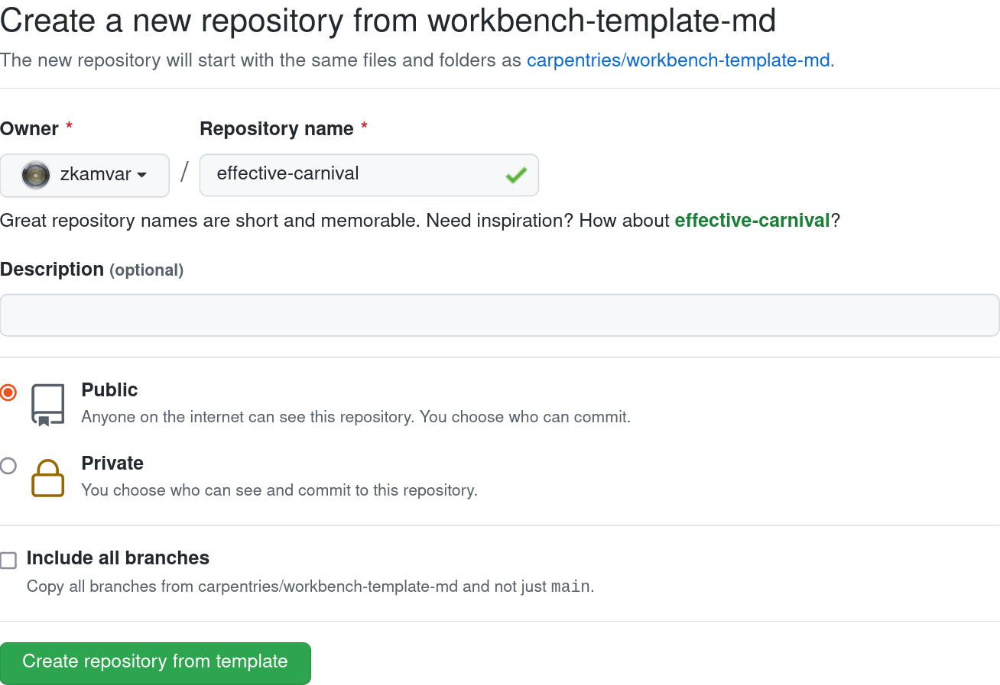

:::::::::::: questions

 - How do I get started?

::::::::::::::::::::::

::::::::::: objectives

- Create new lesson from scratch
- Identify the main command to preview the site
- Understand the basic structure of a new workbench

::::::::::::::::::::::

Let's say you have a set of Markdown or R Markdown files that you used for a
class website that you want to convert into a Carpentries Lesson. To go from
zero to a new lesson website that can auto-render R Markdown documents to a
functional website is three steps with `{sandpaper}`:

1. Create a site
2. Push to GitHub
3. Add your files

That's it. After that, if you know how to write in Markdown, you are good to go.

:::::::::::::::::: callout

### Takeaway message

Contributors should only be expected to know basic markdown and *very* minimal
yaml syntax in order to work on lessons.

:::::::::::::::::::::::::::

## Super Quickstart: Copy A Template from GitHub

The absolute quickest way to get started with The Carpentries Workbench is to 
create a GitHub repository with one of the two available templates, depending on
your preference:

### Step 1: Choose a template

 - [Markdown Lessons (no generated content)](https://github.com/carpentries/workbench-template-md/generate)
 - [R Markdown Lessons (generated content via R)](https://github.com/carpentries/workbench-template-rmd/generate) (our tutorial uses this template)

### Step 2: Choose a name for your lesson repository. 

Name it "buoyant-barnacle". **select "Include All Branches"**. Click on
the button that says "Create repository from template"

::::::::::::: callout

#### Creating a new lesson repository

{alt="Screenshot of a webform that says
'Create a new repository from workbench-template-md'. It says that the new
repository will contain the same files and folders as
carpentries/workbench-template-md and has two required fields for Owner and
Repository Name, which are filled in as ravmakz and buoyant-barnacle. There
is a blank Description option, a radio button that selects public/private, and
an checked checkbox to include all branches"}

::::::::::::::::::::

### Step 3: Customise your site

On GitHub, open the `config.yaml` file, and click on the pencil icon on the top
and edit the values, especially "carpentry", "source", and "title" to reflect
your own repository. Commit the file using the form at the bottom of the page.

That's it. The website should update in about 2-3 minutes with your information.
If you want to continue working directly on GitHub, you can do so. If you want to
work locally, be sure to [follow the setup instructions][setup], clone your
lesson to your computer, open RStudio (or your preferrred interface to R) inside
the lesson folder, and [preview your new lesson](#preview)

## Quickstart: Create a New Lesson

:::::::::::::::::::::::::::: challenge

### Create a Lesson Locally

Follow these steps to create a brand new lesson on your Desktop called
"buoyant-barnacle".

1. Follow the [setup instructions][setup]
2. Open RStudio (or your preferred interface to R)
3. Use the following code:

```r
library("fs") # file system package for cross-platform paths
library("sandpaper")

# Create a brand new lesson on your desktop called "buoyant-barnacle"
bb <- path_home("Desktop/buoyant-barnacle")
print(bb) # print the new path to your screen
create_lesson(bb) # create a new lesson in that path
```

If everything went correctly, you will now have a new RStudio window open to
your new project called "buoyant-barnacle" on your Desktop (if you did not use
RStudio, your working directory should have changed, you can check it via the
`getwd()` command). 

::::::::::::::::::::::::::::::::::

Your lesson will be initialized with a brand new git repository with the initial
commit message being `Initial commit [via {sandpaper}]`. 

:::::::::::::::::::::: callout

### :beetle: Known Quirk

If you are using RStudio, then an RStudio project file (`*.Rproj`) is
automatically created to help anchor your project. You might notice changes to
this file at first as RStudio applies your global user settings to the file.
This is perfectly normal and we will fix this in a future iteration of
{sandpaper}.

::::::::::::::::::::::::::::::

## Previewing Your New Lesson {#preview}

After you created your lesson, you will want to preview it locally. First, make
sure that you are in your newly-created repository and then use the following
command:

```r
sandpaper::serve()
```

:::::::::::::::: discussion

### What's with the `::` syntax?

This is a syntax that clearly states what package a particular function comes 
from. In this case, `sandpaper::serve()` tells R to use the `serve()` function
from the `sandpaper` package. These commands can be run without first calling
`library(<packagename>)`, so they are more portable. I will be using this
syntax for the rest of the lesson.

:::::::::::::::::::::::::::

If you are working in RStudio, you will see a preview of your lesson in the 
viewer pane and if you are working in a different program, a browser window will
open, showing a live preview of the lesson. When you edit files, they will 
automatically be rebuilt to your website. 

:::::::::::::: callout

### DID YOU KNOW? Keyboard Shortcuts are Available

If you are using RStudio, did you know you can use keyboard shortcuts to render
the lesson as you are working on the episodes?

Render and preview the whole lesson
:    <kbd>ctrl + shift + B</kbd>

Render and preview an episode
:    <kbd>ctrl + shift + K</kbd>
::::::::::::::::::::::

The first time you run this function, you might see A LOT of output on your
screen and then your browser will open the preview. If you run the command 
again, you will see much less output. If you like to would like to know how
everything works under the hood, you can check out the [{sandpaper} package
documentation][{sandpaper}].

::::::::::::::::::::::::::::::::::::: discussion

### How do I determine the order of files displayed on the website?

The `config.yaml` file contains four fields that correspond to the folders in
your repository: `episodes`, `instructors`, `learners`, `profiles`. If the list
is empty, then the files in the folders are displayed in alphabetical order,
but if you want to customize exactly what content is published on the website,
you can add a yaml list of the filenames to determine order. 

For example, if you had three episodes called "introduction.md", "part_two.Rmd",
and "in_progress.md" and you wanted to only show introduction and part_two, you
would edit `config.yaml` to list those two files under `episodes:`:

```yaml
episodes:
- introduction.md
- part_two.Rmd
```

::::::::::::::::::::::::::::::::::::::::::::::::


## Push to GitHub

The lesson you just created lives local on your computer, but still needs to go
to GitHub. At this point, we assume that you have successfully [linked your 
computer to GitHub](../learners/setup.md#connect-to-github-1).

1. visit <https://github.com/new/>
2. enter `buoyant-barnacle` as the repository name
3. Press the green "Create Repository" button at the bottom of the page
4. Follow the instructions on the page to push an existing repository from the
   command line. 


A few minutes after you pushed your repository, the GitHub workflows would have
validated your lesson and created deployment branches. You can track the
progress at `https://github.com/<USERNAME>/buoyant-barnacle/actions/`. Once you
have a green check mark, you can [set up GitHub
Pages](https://docs.github.com/en/github/working-with-github-pages/configuring-a-publishing-source-for-your-github-pages-site)
by going to `https://github.com/<USERNAME>/buoyant-barnacle/settings/pages` and
choosing `gh-pages` from the dropdown menu as shown in the image below:

{.image-with-shadow alt='screencapture of the
initial view of the GitHub Pages section of the settings tab'}

Click on the "select branch" button and select "gh-pages":

{.image-with-shadow alt='screencapture of
expanded "select branch" button with "gh-pages" selected'}

::::::::::::: callout

### :hourglass: Be Patient

GitHub needs to start up a new virtual machine the first time you use this, so
it may take anywhere from 4 minutes up to 30 minutes for things to get started:
15 minutes for the workflow to spin up and then another 15 minutes for the
machine to bootstrap and cache. 

:::::::::::::::: 


:::::::::::: callout

### Alternative: Two-step solution in R

If you use R and use an HTTPS protocol, this can be done in a single step from
inside RStudio with the {usethis} package:

```r
usethis::use_github()
usethis::use_github_pages()
```

The `use_github()` function will set up a new repository under your personal
account called `buoyant-barnacle`, add that remote to your `git remotes`, and
automatically push your repository to GitHub. 

The `use_github_pages()` function will signal to GitHub that it should allow
the `gh-pages` branch to serve the website at 
`https://user.github.io/buoyant-barnacle`

The output of these commands should look something like this:

```output
> use_github()
✔ Creating GitHub repository 'zkamvar/buoyant-barnacle'
✔ Setting remote 'origin' to 'https://github.com/zkamvar/buoyant-barnacle.git'
✔ Pushing 'main' branch to GitHub and setting 'origin/main' as upstream branch
✔ Opening URL 'https://github.com/zkamvar/buoyant-barnacle'

> use_github_pages()
✔ Initializing empty, orphan 'gh-pages' branch in GitHub repo 'zkamvar/buoyant-barnacle'
✔ GitHub Pages is publishing from:
• URL: 'https://zkamvar.github.io/buoyant-barnacle/'
• Branch: 'gh-pages'
• Path: '/'
```

If you don't use the HTTPS protocol, and want to find out how to set it in R,
we have [a walkthrough to set your credentials in the learners section
](../learners/github-pat.md).

::::::::::::::::::::

## Tools

As described in [the setup document][setup], The Carpentries Workshop only
requires R and [pandoc] to be installed. The tooling from the styles lesson
template has been split up into three R packages:

1. [{varnish}] contains the HTML, CSS, and JavaScript elements
1. [{pegboard}] is a validator for the markdown documents
1. [{sandpaper}] is the engine that puts everything together. 

::::::::::::: keypoints

- Lessons can be created with `create_lesson()`
- Preview lessons with `serve()`
- The toolchain is designed to be modular.

:::::::::::::::::::::::

