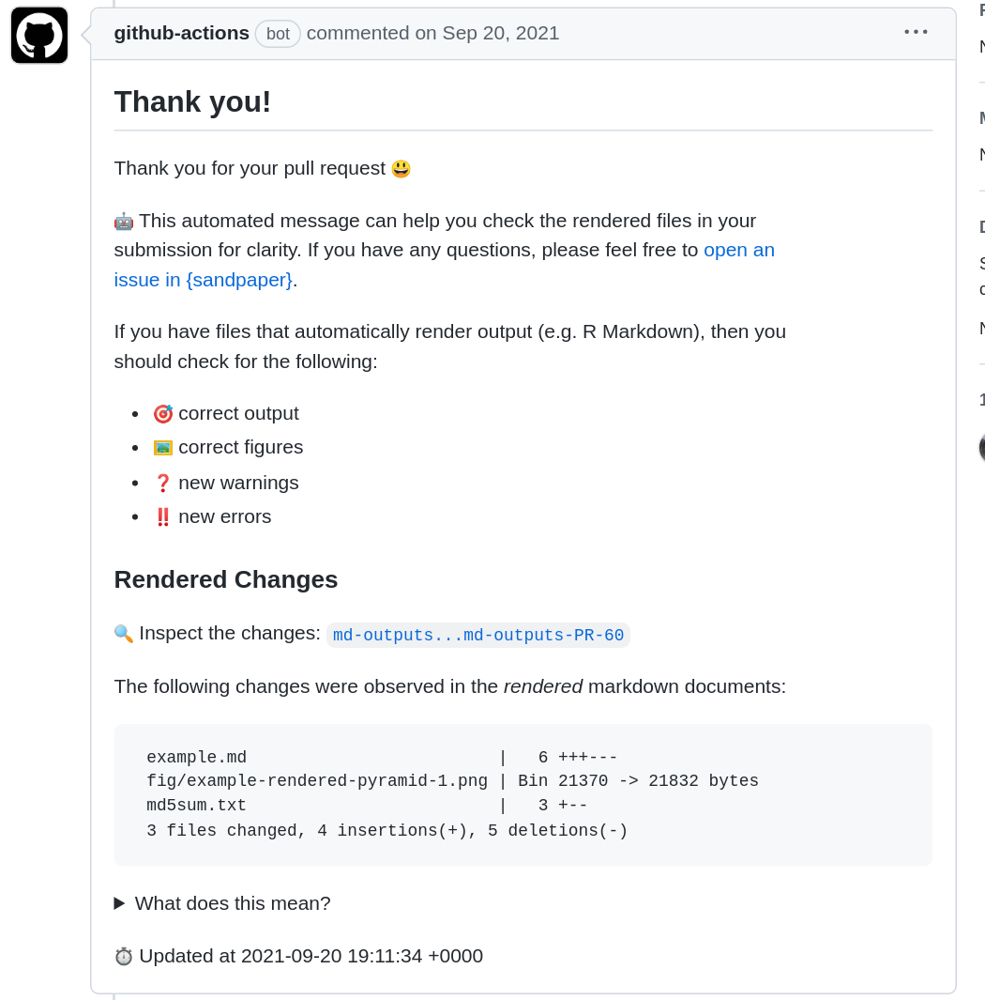

::::::::::::::::::::::::::::: questions

 - What happens during a pull request?
 - How do I review generated content of a pull request?
 - How do I handle a pull request from a bot?

:::::::::::::::::::::::::::::::::::::::

::::::::::::::::::::::::::::: objectives

 - Identify key features of a pull request to review
 - Identify the benefits of pull request comments from a bot
 - Understand why bots will initiate pull requests
 - Understand the purpose of automated pull requests

::::::::::::::::::::::::::::::::::::::::

:::: callout

#### :construction: Under Development

This episode is still actively being developed

::::

## Introduction

One of the biggest benefits of working on a Carpentries Lesson is that it gives
maintainers and contributors practice collaboratively working on GitHub and 
practicing common software engineering practices, including pull requests and
reviews. In the Carpentries Lesson Infrastructure, we have implemented new 
features that will make reviewing contributed content easier for maintainers:

1. Source content is checked for valid headings, links, and images
2. Generated content is rendered to markdown and placed in a temporary branch
   for visual inspection.
3. Pull requests are checked for malicious attacks. 

## Reviewing A Pull Request

When you recieve a pull request, a check will first validate that the lesson can
be built and then, if it okay, it will generate output and leave [a comment that
# provides information about the rendered output](https://github.com/carpentries/sandpaper-docs/pull/60#issuecomment-923204714):

<!-- NOTE: 
To generate this screenshot, use the webshot2 package:

library(webshot2)
repo <- "caprentries/sandpaper-docs"
pr <- 60
comment <- "#issuecomment-923204714"
webshot(glue::glue("https://github.com/{repo}/pull/{pr}{comment}"), 
  file = "episodes/fig/pr-bot-comment.png", 
  selector = c("#issuecomment-923204714"), 
  expand = c(10, 10, 10, 80)
)
-->

{alt="Screenshot of GitHub bot comment informing you 
the message is automated, that you should check for accuracy of rendered output,
and that there were 3 files changed in the rendered markdown documents."}

### Risk Management

Accepting generated content into lessons from anyone runs the risk of a security
breach by exposing secrets. To mitigate this risk, GitHub limits the scope of
what is possible inside a pull request so that we can check and render the 
content without risk of exploitation. Through this, we render and check the 
lesson inside the pull request with no privileges, check that the pull request
is valid (not malicious), and then create a temporary branch for an exploratory
preview, allowing the maintainer to audit the generated content before it gets
adopted into the curriculum. 

If the PR is invalid (e.g. the contributor spoofed a separate, valid PR, or
modified one of the github actions files), then the maintainer is alerted that
the PR is potentially risky.

{alt="Workflow
diagram from a pull request starting from Pull Request, and going to a path
involving validation, artifact creation, maintainer review, and potential
deployment."}

## Automated Pull Requests

There are two situations where you would receive an automated pull request:

1. The workflows need to be updated to the latest versions
2. You have a lesson that uses generated content, the software requirements file
   (e.g. renv.lock or [future] requirements.txt) is updated to the latest
   versions and the lesson is re-built.

:::::::::::::::::::::::::::::: keypoints

- Pull requests for generated formats requires validate of prose and generated content
- Inspecting the rendered markdown output can help maintainers identify changes that occur due to software before they are deployed to the website
- Automated pull requests help keep the infrastructure up-to-date

::::::::::::::::::::::::::::::::::::::::

[rmd-blog]: https://software-carpentry.org/blog/2016/07/rmarkdown-new-template.html
[r4-migration]: https://carpentries.org/blog/2020/08/r-4-migration/
[gh-workflows]: https://docs.github.com/en/actions/ 
[{sandpaper}]: https://carpentries.github.io/sandpaper
[pandoc]: https://pandoc.org/
